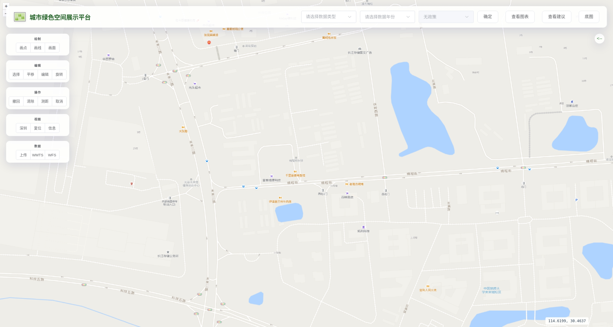

# 城市绿色空间展示平台

基于 Vue 3、OpenLayers 和 Vite 构建的现代化 WebGIS 应用，专注于城市绿地空间的可达性与公平性可视化分析。



> **⚠️ 服务状态说明**
>
> 这里的在线演示链接和后台数据服务目前**不可用**。
> *   **数据服务器**: 原用于存储绿地数据的 GeoServer (`35.234.26.196`) 已过期。
> *   **在线演示**: 部署域名 (`greenviz.top`) 及服务器已过期。
>
> 建议在本地自行搭建 GeoServer 服务，并在 `.env` 文件中配置 `VITE_GEOSERVER_URL` 以运行本项目。

## 项目简介

本项目旨在为城市规划者和研究人员提供一个直观的交互式平台，用于评估和展示城市绿色空间的分布情况。通过集成多源地理空间数据，结合可达性计算模型，系统能够动态展示不同年份（2014、2030、2040、2050）和政策情景下的绿地服务水平。

## 主要功能

- **多维数据可视化**
  - 支持土地利用、绿地可达性、绿地公平性等多类型数据的图层切换与叠加。
  - 提供分年（2014-2050）及不同政策情景的对比分析。

- **交互式地图操作**
  - 集成 OpenLayers 强大的地图引擎，支持无级缩放、平移、旋转。
  - 内置多种底图切换（高德、天地图、OSM、卫星图等）。
  - 提供测距、面积测量、要素查询（点击查看地块详情）等实用工具。

- **矢量绘图与编辑**
  - 支持点、线、面的在线绘制与编辑（平移、旋转、顶点修改）。
  - 支持 GeoJSON 和 Shapefile (ZIP) 格式数据的上传与展示。
  - 绘制要素的属性查看、定位及导出。

- **数据分析图表**
  - 动态生成可达性统计报表与公平性分析图表。
  - 提供针对特定年份和区域的规划建议展示。

## 技术栈

- **前端框架**: Vue 3 (Composition API)
- **构建工具**: Vite
- **地图引擎**: OpenLayers
- **状态管理**: Pinia
- **UI 组件**: Element Plus
- **样式设计**: CSS Variables + Glassmorphism (毛玻璃风格)
- **数据处理**: shpjs, d3.js, proj4

## 环境要求

- Node.js >= 16.0.0
- pnpm >= 8.0.0

## 快速开始

### 1. 安装依赖

推荐使用 pnpm 进行依赖管理：

```bash
pnpm install
```

### 2. 配置环境变量

复制示例配置并设置你的本地 GeoServer 地址：

```bash
cp .env.example .env
```

### 3. 启动开发服务器

```bash
pnpm dev
```

服务默认运行在 `http://localhost:5173` (或根据配置自动调整)。

### 4. 构建生产版本

```bash
pnpm build
```

### 5. 代码规范

```bash
# 格式化代码
pnpm format

# 检查格式
pnpm format:check
```

## 目录结构

```text
src/
├── assets/          # 静态资源
├── components/      # Vue 组件 (地图工具、图层管理、图表等)
├── stores/          # Pinia 状态管理
├── styles/          # 全局样式 (CSS 变量、主题)
├── utils/           # 工具函数 (地图图层创建、坐标转换)
├── views/           # 页面视图
└── main.js          # 入口文件
public/
├── geojson/         # 示例地理数据
├── images/          # 图标与图例资源
└── icon.png         # 应用图标
```