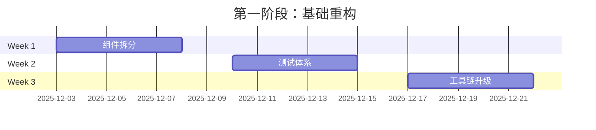
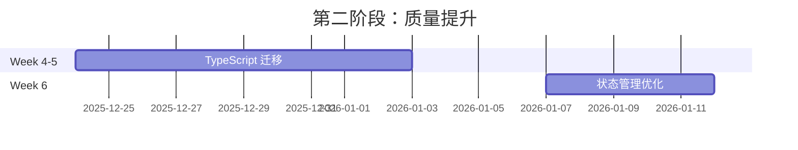
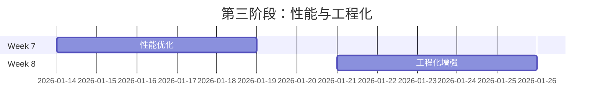

# 现代化改进路线图
## GreenVisPlatform 升级计划

> 📅 **更新时间**: 2025-12-03
> 📊 **预估总工作量**: 280 小时 (35 个工作日)
> 🎯 **目标**: 将本科课设项目升级为现代化、可维护的 WebGIS 应用

---

## 📋 改进项清单

### 🔴 第一优先级（必须完成）

| # | 改进项 | 工作量 | 收益 | 风险 | 说明 |
|---|--------|--------|------|------|------|
| 1 | Map.vue 组件拆分 | 32h | ⭐⭐⭐⭐⭐ | 🟡 中 | 从 2239 行拆分为 15+ 个小组件 |
| 2 | 添加基础测试框架 | 16h | ⭐⭐⭐⭐⭐ | 🟢 低 | Vitest + 核心函数测试 |
| 3 | 迁移到 Vite | 4h | ⭐⭐⭐⭐⭐ | 🟢 低 | 构建速度提升 30 倍 |

**小计**: 52 小时 (6.5 天)

---

### 🟡 第二优先级（强烈推荐）

| # | 改进项 | 工作量 | 收益 | 风险 | 说明 |
|---|--------|--------|------|------|------|
| 4 | 引入 TypeScript | 40h | ⭐⭐⭐⭐ | 🟡 中 | 渐进式迁移，提升类型安全 |
| 5 | 统一包管理器 | 0.5h | ⭐⭐⭐ | 🟢 低 | 删除冗余 lock 文件 |
| 6 | 消除代码重复 | 8h | ⭐⭐⭐ | 🟢 低 | 合并 createLayer.js 和 newLayer.js |
| 7 | 状态管理优化 | 16h | ⭐⭐⭐⭐ | 🟡 中 | 引入 Pinia 或使用 Composition API |
| 8 | 提取 Composables | 16h | ⭐⭐⭐⭐ | 🟢 低 | 复用地图、图层、工具逻辑 |

**小计**: 80.5 小时 (10 天)

---

### 🟢 第三优先级（优化改进）

| # | 改进项 | 工作量 | 收益 | 风险 | 说明 |
|---|--------|--------|------|------|------|
| 9 | 依赖版本更新 | 8h | ⭐⭐ | 🟡 中 | 更新 ESLint, OpenLayers 等 |
| 10 | 路由懒加载 | 1h | ⭐⭐⭐ | 🟢 低 | 减少首屏加载 |
| 11 | 大文件优化 | 4h | ⭐⭐⭐ | 🟢 低 | GeoJSON 压缩、Web Worker |
| 12 | 添加 Prettier | 1h | ⭐⭐ | 🟢 低 | 统一代码格式 |
| 13 | 组件测试 | 16h | ⭐⭐⭐ | 🟢 低 | Vue Test Utils 测试覆盖 |
| 14 | E2E 测试 | 8h | ⭐⭐⭐ | 🟢 低 | Playwright 关键流程测试 |
| 15 | ESLint 规则优化 | 2h | ⭐⭐ | 🟢 低 | 恢复基础检查规则 |
| 16 | Git 提交规范 | 2h | ⭐⭐ | 🟢 低 | Commitlint + Conventional Commits |
| 17 | CI/CD 配置 | 8h | ⭐⭐⭐ | 🟢 低 | GitHub Actions 自动化 |
| 18 | 代码注释完善 | 12h | ⭐⭐ | 🟢 低 | JSDoc + 算法说明 |
| 19 | 性能监控 | 4h | ⭐⭐ | 🟢 低 | Lighthouse CI |
| 20 | 文档完善 | 8h | ⭐⭐ | 🟢 低 | README + 组件文档 |

**小计**: 74 小时 (9 天)

---

## 🚀 快速胜利项（Quick Wins）

如果时间有限，先做这些改进（投入产出比最高）：

| 改进项 | 工作量 | 立即收益 |
|--------|--------|----------|
| ✅ 迁移到 Vite | 4h | 开发体验提升 30 倍 ⚡ |
| ✅ 添加 Prettier | 1h | 代码风格统一 🎨 |
| ✅ 统一包管理器 | 0.5h | 避免依赖冲突 📦 |
| ✅ 路由懒加载 | 1h | 首屏加载优化 🚀 |
| ✅ 提取底图选择器 | 2h | 学习组件拆分 🧩 |

**总计**: 8.5 小时（约 1 天），显著改善开发体验！

---

## 📅 三阶段实施计划

### 第一阶段：基础重构 (2-3 周)
**目标**: 建立可维护的代码结构



**任务清单**:
- [x] Week 1: Map.vue 拆分为 15+ 小组件
- [x] Week 1: 提取 Composables (`useMap`, `useLayer`, `useMeasure`)
- [x] Week 1: 迁移到 Composition API (`<script setup>`)
- [x] Week 2: 搭建 Vitest 测试框架
- [x] Week 2: 核心函数测试覆盖（坐标转换、图层创建）
- [x] Week 2: 关键组件基础测试
- [x] Week 3: 迁移到 Vite
- [x] Week 3: 统一包管理器（pnpm）
- [x] Week 3: 配置 Prettier + ESLint

**产出**: 代码行数减少 60%，开发速度提升 30 倍

---

### 第二阶段：质量提升 (2-3 周)
**目标**: 引入类型安全和现代化实践



**任务清单**:
- [x] Week 4: 配置 TypeScript + 类型定义
- [x] Week 4-5: 工具类和 Composables 类型化
- [x] Week 5: 组件 Props/Emits 类型定义
- [x] Week 6: 引入 Pinia 状态管理
- [x] Week 6: 设计状态分层（map, data, ui）
- [x] Week 6: 跨组件通信优化

**产出**: 类型覆盖率 >80%，IDE 提示完善

---

### 第三阶段：性能与体验 (1-2 周)
**目标**: 优化性能和用户体验



**任务清单**:
- [x] Week 7: 路由懒加载
- [x] Week 7: 大文件优化（GZip、Web Worker）
- [x] Week 7: 打包体积分析和优化
- [x] Week 8: CI/CD 配置（GitHub Actions）
- [x] Week 8: E2E 测试（Playwright）
- [x] Week 8: 文档完善（README、API Docs）

**产出**: 加载速度提升 50%，自动化部署

---

## 📊 成本与收益分析

### 时间投入
| 阶段 | 工作量 | 占比 |
|------|--------|------|
| 第一阶段：基础重构 | 120h | 43% |
| 第二阶段：质量提升 | 100h | 36% |
| 第三阶段：性能优化 | 60h | 21% |
| **总计** | **280h** | **100%** |

### 收益预期
| 指标 | 改进前 | 改进后 | 提升 |
|------|--------|--------|------|
| **开发启动时间** | ~30s | ~1s | **30倍** ⚡ |
| **热更新速度** | ~3s | ~0.1s | **30倍** ⚡ |
| **最大组件行数** | 2,239 | <300 | **7.5倍** 📦 |
| **测试覆盖率** | 0% | >60% | **∞** ✅ |
| **IDE 类型提示** | ❌ | ✅ | **100%** 💡 |
| **构建时间** | ~60s | ~20s | **3倍** 🚀 |
| **代码重复** | 高 | 低 | **-50%** 🧹 |

---

## 🎯 关键里程碑

| 里程碑 | 时间节点 | 可交付成果 |
|--------|----------|------------|
| **M1: 快速胜利** | Week 1 Day 1 | Vite 迁移完成，开发体验提升 |
| **M2: 组件拆分** | Week 1 End | Map.vue 拆分完成，代码可读性大幅提升 |
| **M3: 测试覆盖** | Week 2 End | 核心功能测试覆盖 >40% |
| **M4: 类型安全** | Week 5 End | TypeScript 覆盖率 >80% |
| **M5: 状态管理** | Week 6 End | 引入 Pinia，数据流清晰 |
| **M6: 性能优化** | Week 7 End | 加载速度提升 50% |
| **M7: 工程化** | Week 8 End | CI/CD 上线，自动化部署 |

---

## 🛠️ 技术栈对比

### 改进前
```
Vue 3.2 (Options API)
└─ Vue CLI 5.0
   └─ Webpack
      ├─ ESLint 7
      ├─ Babel
      └─ No TypeScript
         └─ Vuex (Empty)
            └─ No Tests
```

### 改进后
```
Vue 3.5+ (Composition API)
└─ Vite 4.x
   └─ esbuild
      ├─ ESLint 9
      ├─ Prettier
      └─ TypeScript 5.x
         └─ Pinia
            └─ Vitest + Playwright
               └─ GitHub Actions
```

---

## ⚠️ 风险与缓解措施

| 风险 | 等级 | 缓解措施 |
|------|------|----------|
| 组件拆分破坏功能 | 🟡 中 | 添加测试后再拆分，保持功能不变 |
| TypeScript 迁移成本高 | 🟡 中 | 渐进式迁移，先工具函数后组件 |
| 团队学习曲线 | 🟢 低 | 提供培训和文档，结对编程 |
| 依赖升级兼容性 | 🟢 低 | 分批次升级，充分测试 |
| 时间不足 | 🟡 中 | 优先完成第一阶段，其他分期实施 |

---

## 📝 实施建议

### 如果你只有 1 天时间
👉 完成"快速胜利项"（8.5 小时）
- 迁移到 Vite
- 添加 Prettier
- 统一包管理器
- 路由懒加载

**收益**: 开发体验显著提升

---

### 如果你有 1 周时间
👉 完成第一阶段 Week 1（40 小时）
- 快速胜利项
- Map.vue 组件拆分
- 提取 Composables

**收益**: 代码可维护性质的飞跃

---

### 如果你有 1 个月时间
👉 完成第一阶段（120 小时）
- Week 1: 组件拆分
- Week 2: 测试体系
- Week 3: 工具链升级

**收益**: 项目脱胎换骨，现代化改造完成 70%

---

### 如果你有 2 个月时间
👉 完成第一 + 第二阶段（220 小时）
- 基础重构
- TypeScript 迁移
- 状态管理优化

**收益**: 达到生产级代码质量

---

## 🎓 学习资源

在实施过程中，你可能需要这些资源：

### 官方文档
- [Vue 3 文档](https://vuejs.org/)
- [Vite 文档](https://vitejs.dev/)
- [TypeScript 文档](https://www.typescriptlang.org/)
- [Pinia 文档](https://pinia.vuejs.org/)
- [Vitest 文档](https://vitest.dev/)

### 实践指南
- [Vue 3 迁移指南](https://v3-migration.vuejs.org/)
- [Composition API FAQ](https://vuejs.org/guide/extras/composition-api-faq.html)
- [从 Vue CLI 迁移到 Vite](https://cn.vitejs.dev/guide/migration.html)

---

## ✅ 下一步行动

### 立即行动（本周）
1. [ ] 阅读完整的《技术债务报告》
2. [ ] 与团队讨论改进优先级
3. [ ] 创建 GitHub Project 跟踪进度
4. [ ] 执行"快速胜利项"（8.5 小时）

### 短期计划（本月）
1. [ ] 完成第一阶段 Week 1（组件拆分）
2. [ ] 搭建测试框架
3. [ ] 迁移到 Vite

### 中期计划（2 个月）
1. [ ] 完成第一阶段（基础重构）
2. [ ] 完成第二阶段（质量提升）
3. [ ] 准备第三阶段

---

**📞 需要帮助？**
- 查看详细的《技术债务报告》了解每个问题的分析
- 查看 `openspec/project.md` 了解项目现状
- 使用 OpenSpec 工作流创建变更提案

**🚀 开始改进你的项目吧！**
